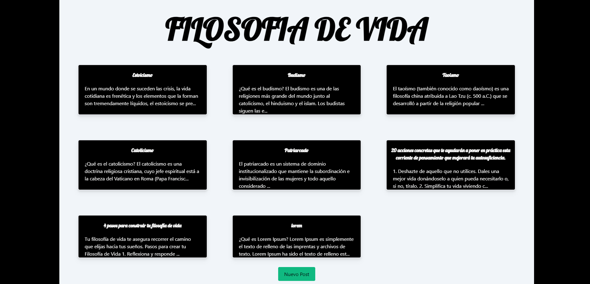
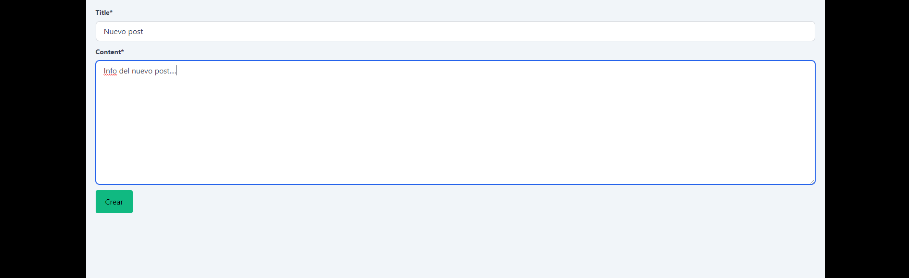
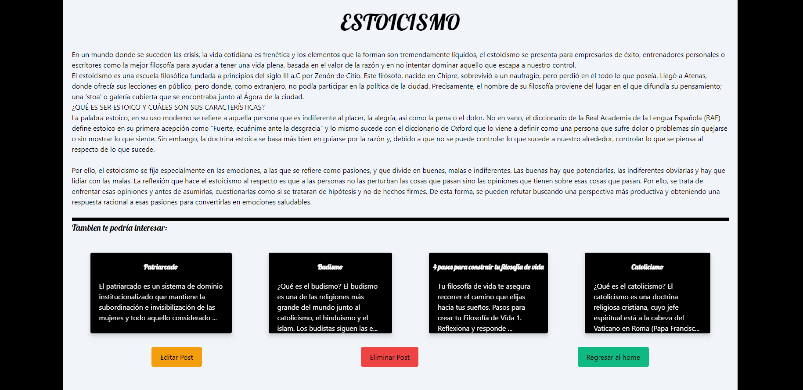
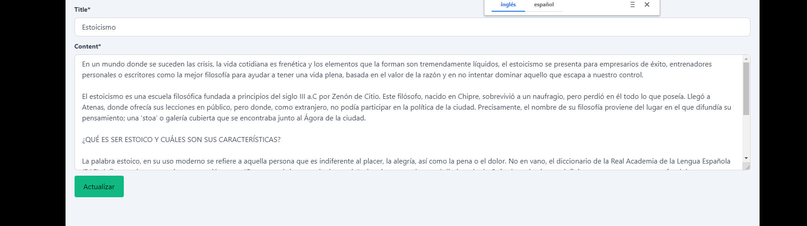

## BLOG (FILOSOFIAS DE VIDA)

1. [Descripción](#descripcion)
2. [Desarrollo](#desarrollo)
3. [Instalación](#instalacion)
4. [Autor](#autor)
5. [FAQs](#faqs)
6. [Pantallazos](#pantallazos)

### Descripcion

---

Este es un blog el cual cuenta con un home con N posts sobre temas relacionados a filosofias de vida donde se pueden crear nuevos posts, editar y eliminar cada uno de ellos.

## Desarrollo

---

Esta plataforma se desarrollo con el framework Django proveniente del lenguaje de programación python y con ayuda de tailwind para su macketado y estética

## Instalacion

---

La instalación del proyecto es muy sencilla, siga las instrucciones:

Abra su terminal y ejecute los siguientes comandos

```
$ git clone https://github.com/ManuBedoya/blogFilosofias.git
$ cd blogFilosofias
$ pip install -r requirements.txt
$ python manage.py runserver
```

En una terminal aparte correr el siguiente comando

```
$ python manage.py tailwind start
```

## Autor

---

Manuel Bedoya - manuelfernandobedoya@gmail.com

## FAQs

---

## Pantallazos





